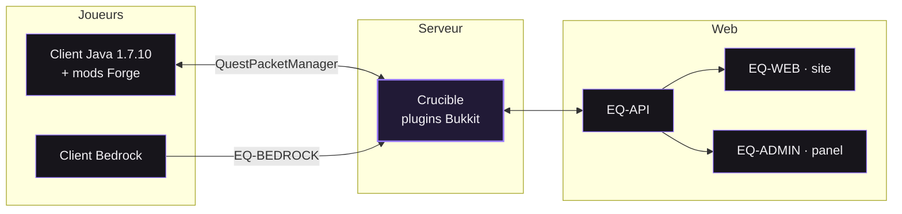

<!--
  Profil de Salks. — DA : Plus Jakarta Sans, JetBrains Mono, un seul violet.
  assets/*          → node scripts/build-static.mjs
  assets/generated/ → régénéré chaque nuit par .github/workflows/profile.yml
-->

<picture>
  <source media="(prefers-color-scheme: light)" srcset="./assets/hero-light.svg"/>
  
</picture>

  <a href="#projets"><picture><source media="(prefers-color-scheme: light)" srcset="./assets/btn-projects-light.svg"/></picture></a>
  &nbsp;
  <a href="#contact"><picture><source media="(prefers-color-scheme: light)" srcset="./assets/btn-contact-light.svg"/></picture></a>

<picture>
  <source media="(prefers-color-scheme: light)" srcset="./assets/cover-light.svg"/>
  
</picture>

<picture>
  <source media="(prefers-color-scheme: light)" srcset="./assets/generated/tiles-light.svg"/>
  
</picture>

 

<!-- ─────────────────────────────────────────────────────────── qui suis-je -->

<picture>
  <source media="(prefers-color-scheme: light)" srcset="./assets/section-about-light.svg"/>
  
</picture>

Je développe des serveurs Minecraft et les outils qui vont autour depuis plusieurs années. 
Plugins, mods Forge, systèmes de jeu complets, panels d'administration, sites vitrines : 
je prends le projet du schéma de base de données jusqu'à la mise en prod.

Aujourd'hui je passe en <b>freelance</b> et j'ouvre mon agenda à de nouveaux projets.

  <code>BASE</code>&nbsp; France · Remote &nbsp;&nbsp;&nbsp; <code>ÉQUIPE</code>&nbsp; <a href="https://github.com/EarthQuestMc">@EarthQuestMc</a> &nbsp;&nbsp;&nbsp; <code>DISCORD</code>&nbsp; salks

 

<!-- ─────────────────────────────────────────────────────────────── projets -->

<picture>
  <source media="(prefers-color-scheme: light)" srcset="./assets/section-projects-light.svg"/>
  
</picture>

  <a href="https://github.com/EarthQuestMc"><picture><source media="(prefers-color-scheme: light)" srcset="./assets/projects/earthquest-light.svg"/></picture></a>
  <picture><source media="(prefers-color-scheme: light)" srcset="./assets/projects/kernpath-light.svg"/></picture>

  <picture><source media="(prefers-color-scheme: light)" srcset="./assets/projects/portfolio-light.svg"/></picture>
  <picture><source media="(prefers-color-scheme: light)" srcset="./assets/projects/gameoflife-light.svg"/></picture>

  <picture><source media="(prefers-color-scheme: light)" srcset="./assets/projects/myschool-light.svg"/></picture>
  <picture><source media="(prefers-color-scheme: light)" srcset="./assets/projects/pronote-bot-light.svg"/></picture>

<b>Comment EarthQuest est construit</b> (diagramme, zoom et déplacement possibles)

 

<b>Et aussi</b>

 

- **Cairn** — l'ancêtre de Kernpath : Git, GitHub et Trello dans une app native Tauri.
- **Satisfactory** — mes forks de [FicsIt-Networks](https://github.com/SalksCore/FicsIt-Networks) et [FicsIt-Cam](https://github.com/SalksCore/FicsIt-Cam) (C++, Unreal).
- **MicroBit** — [le code de mes cartes micro:bit](https://github.com/SalksCore/MicroBit).

 

<!-- ────────────────────────────────────────────────────────────── parcours -->

<picture>
  <source media="(prefers-color-scheme: light)" srcset="./assets/section-journey-light.svg"/>
  
</picture>

<picture>
  <source media="(prefers-color-scheme: light)" srcset="./assets/journey-light.svg"/>
  
</picture>

 

<!-- ─────────────────────────────────────────────────────────── compétences -->

<picture>
  <source media="(prefers-color-scheme: light)" srcset="./assets/section-stack-light.svg"/>
  
</picture>

<picture>
  <source media="(prefers-color-scheme: light)" srcset="./assets/stack-light.svg"/>
  
</picture>

 

<!-- ────────────────────────────────────────────────────────────── activité -->

<picture>
  <source media="(prefers-color-scheme: light)" srcset="./assets/section-activity-light.svg"/>
  
</picture>

<picture>
  <source media="(prefers-color-scheme: light)" srcset="./assets/generated/activity-light.svg"/>
  
</picture>

<picture>
  <source media="(prefers-color-scheme: light)" srcset="./assets/generated/languages-light.svg"/>
  
</picture>

<picture>
  <source media="(prefers-color-scheme: light)" srcset="https://raw.githubusercontent.com/SalksCore/SalksCore/output/snake-light.svg"/>
  
</picture>

 

<!-- ───────────────────────────────────────────────────────────── livre d'or -->

<picture>
  <source media="(prefers-color-scheme: light)" srcset="./assets/section-guestbook-light.svg"/>
  
</picture>

  <a href="https://github.com/SalksCore/SalksCore/issues/new?title=livre-d-or&body=Ton+message+ici+(140+caract%C3%A8res+max)"><picture><source media="(prefers-color-scheme: light)" srcset="./assets/btn-guestbook-light.svg"/></picture></a>

<!-- GUESTBOOK:START -->

Personne n'a encore signé. À toi l'honneur.

<!-- GUESTBOOK:END -->

 

<!-- ─────────────────────────────────────────────────────────────── contact -->

<picture>
  <source media="(prefers-color-scheme: light)" srcset="./assets/section-contact-light.svg"/>
  
</picture>

  <a href="mailto:salks@earthquest.fr"><picture><source media="(prefers-color-scheme: light)" srcset="./assets/btn-email-light.svg"/></picture></a>
  &nbsp;
  <picture><source media="(prefers-color-scheme: light)" srcset="./assets/btn-discord-light.svg"/></picture>

 

<picture>
  <source media="(prefers-color-scheme: light)" srcset="./assets/footer-light.svg"/>
  
</picture>

